## 목표
- 웹 아키텍처를 이해하고 활용할 수 있다.
- Spring Framework와 myBatis Framework를  활용하여 웹 서버를 구축할 수 있다.
- MVC 아키텍처를 활용하여 확장성과 유지보수성 좋은 웹 서버를 구축할 수 있다. 

## 구현 기본(필수) 기능
1)  메인 페이지(실거래 정보를 활용하여 구성) (Spring & MyBatis 기반)  
2)  동별 실거래가 검색 결과 페이지 (Spring & MyBatis 기반)  
3)  아파트별 실거래가 검색 결과 페이지 (Spring & MyBatis 기반)  
4)  회원정보 등록, 수정, 삭제, 검색 페이지 (Spring & MyBatis 기반)  
5)  로그인/ 로그아웃 페이지 (Spring & MyBatis 기반) 

#### 추가 기능
1) 메인화면 Google API 활용  

## Class_Diagram
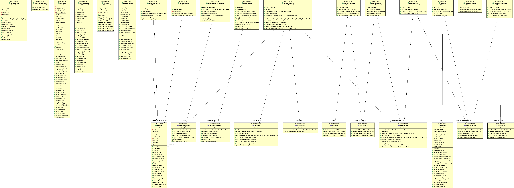

## 참고 화면

## 1. 메인 페이지
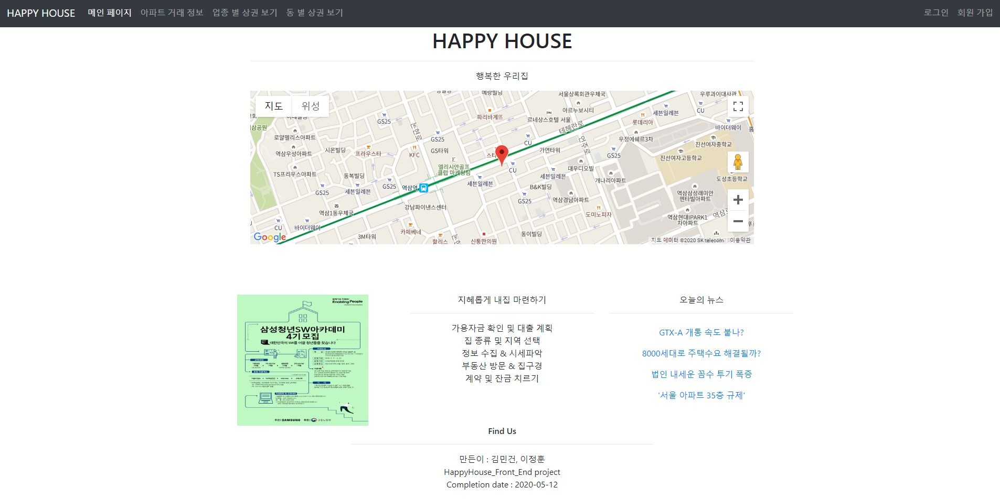

## 2. 동별 실거래가 검색 결과 페이지 
2.1 조회  
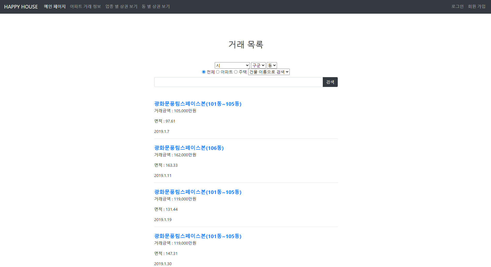  

#### 3. 아파트별 실거래가 검색 결과 페이지 

3-1. 실거래 메인페이지  
  

3-2. 실거래 지역 검색  
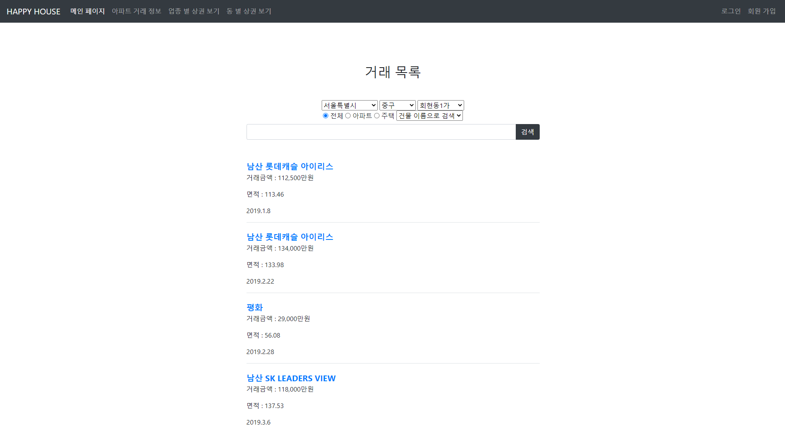  

3-3. 실거래 상세 검색  
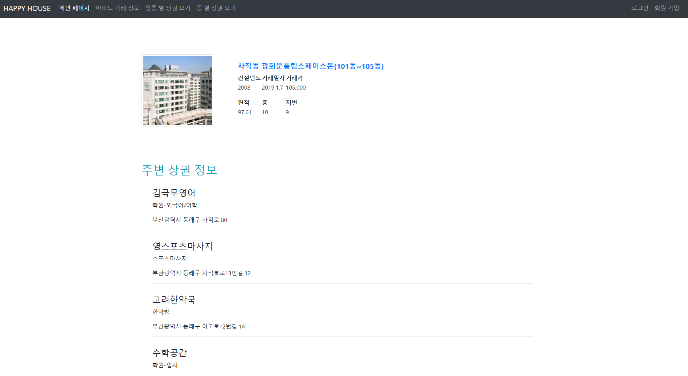  

3-4. 상관 정보
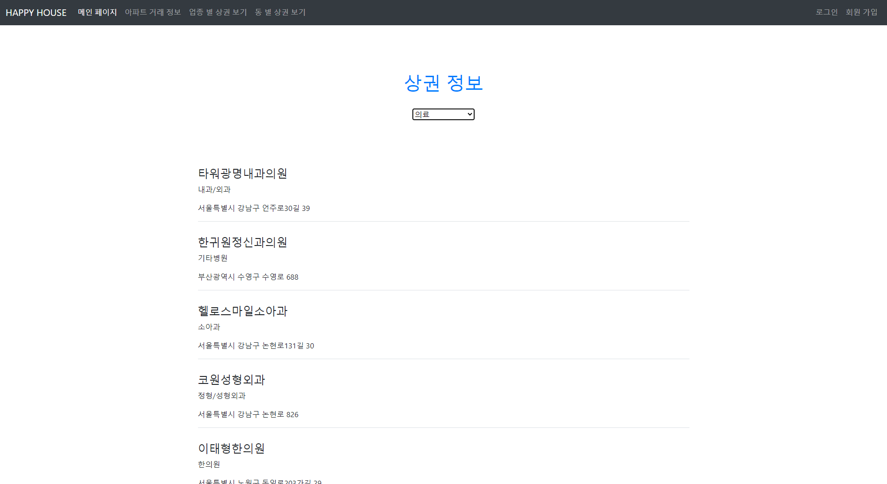  
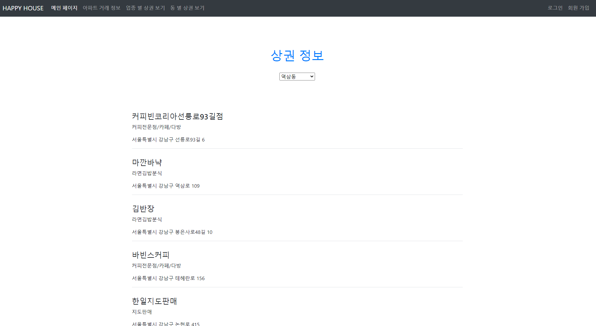  

#### 4. 회원정보 등록, 수정, 삭제, 검색 페이지 

4.1 회원 가입  
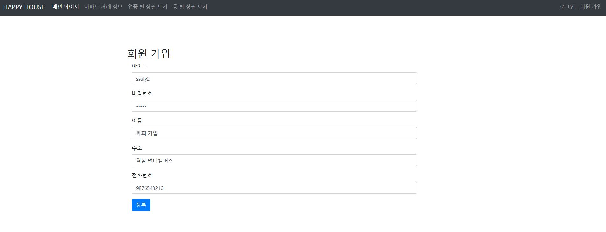  

4.2 회원 정보 조회  
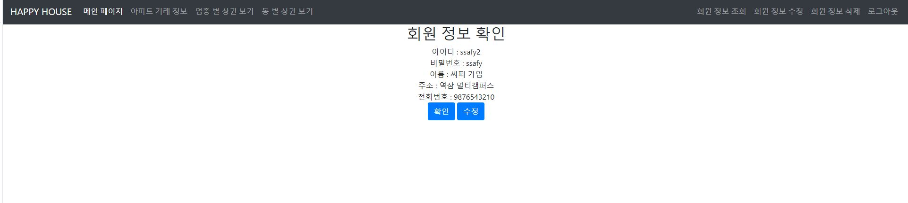  

4.3 회원 정보 수정   
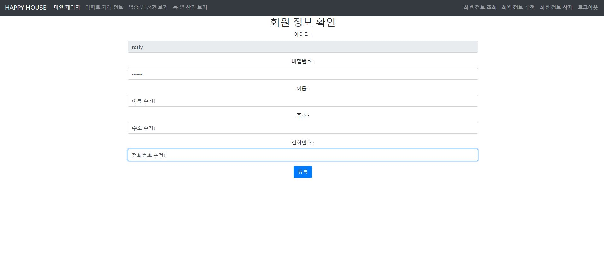  
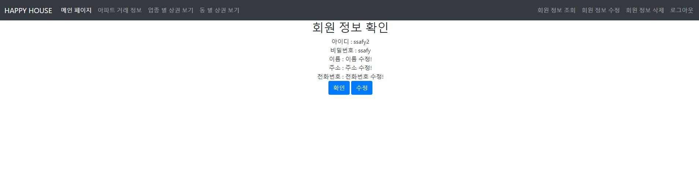  

4.4 회원 정보 삭제(탈퇴)   
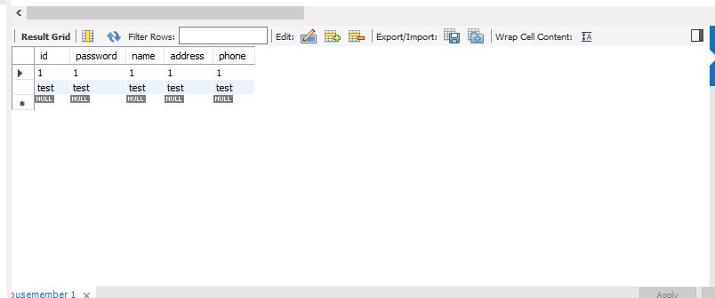  

#### 5. 로그인/ 로그아웃 페이지 
5.1 로그인  
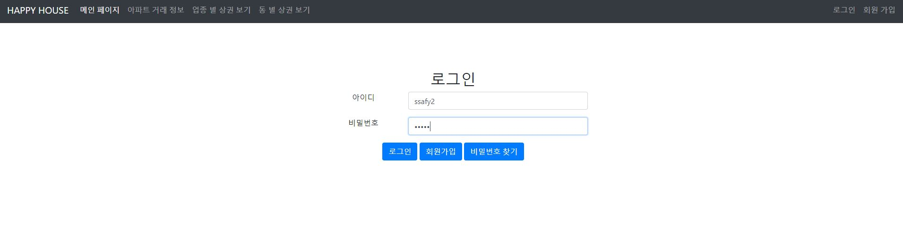  
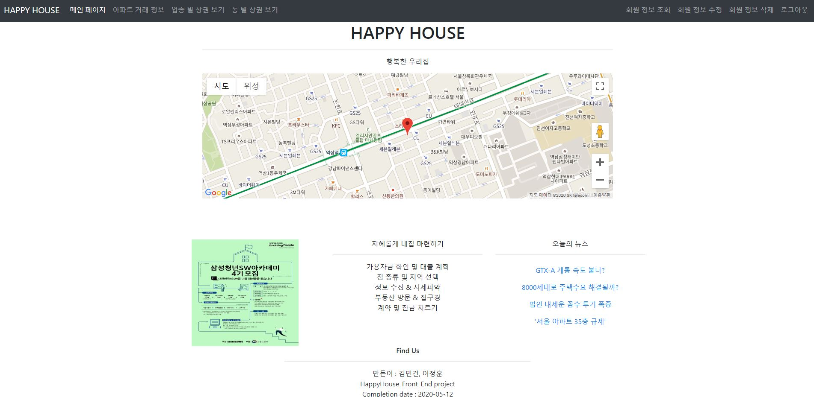  

5.2 로그아웃 페이지  

